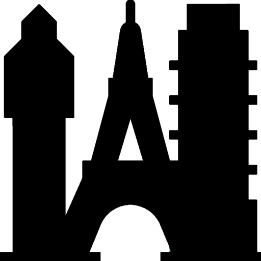
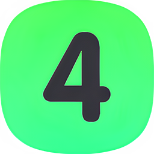

<h1 align="center">
   
  <picture>
  <source media="(prefers-color-scheme: dark)" srcset="Images/LogoLight.png">
  
  </picture>
  <!--a href="#"></a-->
   
  Iconic - TheyCallMePapa
   
</h1>

<h4 align="center">An app that has six different sites to find free icons. You can change sites in the app by clicking one of the six icons in the upper right..</h4>

  
  
  
  

  <a href="#key-features">Key Features</a> •
  <a href="#how-to-use">How To Use</a> •
  <a href="#download">Download</a> •
  <a href="#credits">Credits</a> •
  <a href="#license">License</a>

## Key Features
An app that has six different sites to find free icons. .

## How to use
You can change sites in the app by clicking one of the six icons in the upper right.

## Download
## https://github.com/papa-boynton/Iconic-TheyCallMePapa/releases/tag/latest
https://droptopfour.com/community-apps/

## Credits
Written by [TheyCallMePapa](https://github.com/papa-boynton).

## License
Creative Commons Attribution-Non-Commercial-Share Alike 3.0
